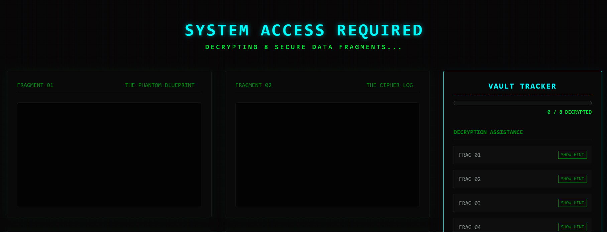

<div align="center">
  <h1>🔒 The Cyber Vault</h1>
  <p><strong>An interactive front-end Capture-The-Flag (CTF) experiment.</strong></p>
  
  
  
  
</div>

---

## 🚀 About This Project

**The Cyber Vault** is a fun, interactive puzzle game I built for my personal portfolio to showcase creative front-end web development, DOM manipulation, and browser mechanics.

Instead of a standard landing page, this site is a simulated highly-secure terminal containing 8 encrypted "Fragments". To decrypt them, you have to use actual web-developer skills (like inspecting the DOM, editing Local Storage, checking the Network tab, and manipulating the viewport) to bypass the security measures!

## 📸 In Action

> **Note:** Here is a sneak peek of the vault in action, featuring the interactive CSS flashlight mask and keyboard-evading UI.

<div align="center">
  
  
</div>

## 🧩 The 8 Security Fragments

Each snippet of data is protected by a different front-end trick:

1. 🔦 **The Phantom Blueprint:** Uses advanced CSS `radial-gradient` masking to hide an image in darkness until you hover your mouse like a flashlight.
2. 🕳️ **The Cipher Log:** Text perfectly color-matched to the background (`#030303`) with `user-select: none`. It can only be read by inspecting the HTML tree.
3. 👻 **The Ghost Protocol:** The HTML for this puzzle doesn't even exist on load. You must manually execute the injection protocol via the DevTools Console.
4. 🏃‍♂️ **The Glitch Keypad:** An evasive button that calculates relative positioning to run away from your mouse cursor on hover. (Hint: Use your `Tab` key).
5. 📐 **The Dimension Restrictor:** Locked behind precise CSS `@media` queries. The secret only reveals itself when the browser viewport hits exactly `404px` wide.
6. 🌐 **The Network Phantom:** A simulated 403 API fetch failure masking a hidden payload that can only be found by inspecting the browser's Network tab.
7. 📦 **The Local Stash:** An automated tracker polls your browser's Application Storage waiting for you to manually inject a specific `localStorage` clearance token.
8. 🎮 **The Ghost in the Machine:** A global event listener tracking silent keystrokes, waiting for you to type `VAULT` (Konami-code style) to unlock the final secret.

## ⚙️ The Auto-Tracking Engine

The interface includes a fixed **Vault Tracker** sidebar that automatically monitors your progress silently using event listeners and DOM observers. When you trigger the exact right condition for a puzzle (e.g., highlighting invisible text), the system instantly detects it, lights up the module neon-green, and stamps it as `DECRYPTED`. 

## 🛠️ How to Run Locally

Want to try hacking the vault yourself? 

```bash
# Clone the repository
git clone https://github.com/Kavypatel07/cyber-vault.git

# Navigate into the directory
cd cyber-vault

# Install dependencies
npm install

# Start the local development server
npm run dev
```

Open `http://localhost:5173` in your browser and open up your DevTools (F12)—you're going to need them!🔏🤫

---
<div align="center">
  <i>Built with fun🍵 and Vanilla JS.</i>
</div>
